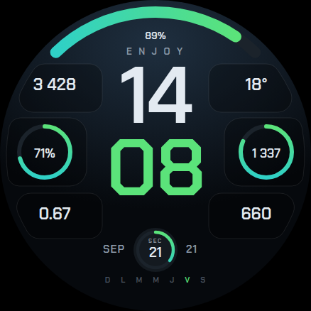

# Summit — cadran Watch Face Format

Cadran pour **Galaxy Watch8 Classic 46 mm**, écrit en [Watch Face Format](https://developer.android.com/training/wearables/wff).
Le paquet ne contient **aucun code** : uniquement des ressources (`android:hasCode="false"`).



## Ce que fait le cadran

- Toile **438 × 438**, sans graduation peinte : la lunette du Watch8 Classic est physique.
- **7 emplacements de complication.** La liste des sources vient de la montre, pas du cadran :
  Samsung Health, météo, agenda, et toute application installée qui publie une complication.
- **8 thèmes de couleur** (`ColorConfiguration`), accords analogues pour que le dégradé des jauges reste franc.
- **4 polices pour l'heure** (`ListConfiguration`), embarquées dans le paquet.
- **3 interrupteurs** (`BooleanConfiguration`) : cadres des données, arc de batterie, jours de la semaine.
- Variante **Always On Display** : tuiles réduites à leur filet, secondes et arc coupés.

## Construire

Depuis Android Studio : ouvrir le dossier, laisser Gradle se synchroniser, puis
*Build → Build APK(s)*. C'est la voie la plus simple, le SDK et le JDK viennent avec l'IDE.

En ligne de commande, avec le SDK Android installé (compileSdk 35) et un JDK 17 :

```bash
./gradlew :app:assembleDebug      # macOS, Linux
gradlew.bat :app:assembleDebug    # Windows
```

L'APK sort dans `app/build/outputs/apk/debug/app-debug.apk`.

## Installer sur la montre

1. Montre → Paramètres → À propos de la montre → Informations logiciel → taper **5 fois** sur
   *Version du logiciel*. Les Options de développement apparaissent.
2. Options de développement → activer **Débogage ADB** et **Débogage sans fil**.
3. *Débogage sans fil* → **Associer la montre** : la montre affiche une IP, un port et un code.
   Montre et ordinateur sur le même Wi-Fi.
4. Sur l'ordinateur :

```bash
adb pair 192.168.x.x:PORT     # saisir le code à six chiffres
adb connect 192.168.x.x:5555
adb install -r app/build/outputs/apk/debug/app-debug.apk
```

5. Appui long sur le cadran actuel : *Summit* est dans la liste. Les réglages sont aussi dans
   Galaxy Wearable → Cadrans → Personnaliser.

## Structure

```
app/src/main/
├── AndroidManifest.xml              service + propriété de version du format
└── res/
    ├── raw/watchface.xml            tout le cadran
    ├── xml/watch_face_info.xml      métadonnées du sélecteur
    ├── values/strings.xml           libellés des réglages (français)
    ├── font/                        4 polices OFL
    └── drawable-nodpi/
        ├── tile_*_normal.png        les 6 tuiles à bord courbe
        ├── tile_*_ambient.png       leur variante AOD (filet seul)
        └── preview.png              aperçu 438 × 438
```

## Géométrie

Origine en haut à gauche, centre (219, 219), bord de dalle R 219.

| Élément | x | y | l | h |
|---|---|---|---|---|
| Complication 1 — haut gauche | 10 | 90 | 134 | 68 |
| Complication 2 — haut droite | 294 | 90 | 134 | 68 |
| Complication 3 — jauge gauche | 4 | 166 | 118 | 96 |
| Complication 4 — jauge droite | 316 | 166 | 118 | 96 |
| Complication 5 — bas gauche | 10 | 272 | 134 | 64 |
| Complication 6 — bas droite | 294 | 272 | 134 | 64 |
| Complication 7 — anneau bas | 188 | 321 | 62 | 62 |

Arc de batterie : R 202, épaisseur 16, de −44° à +44°.
Bord extérieur des tuiles : arc **R 210**, congés de 20 px (16 px pour les jauges).
WFF n'ayant pas de primitive `Path`, les tuiles sont des PNG générés depuis ces tracés.

## À valider au premier build

Ces points sont écrits d'après la documentation officielle mais n'ont pas été compilés ni exécutés.
Le compilateur et le validateur WFF les signaleront immédiatement.

- Noms de sources de données : `[BATTERY_PERCENT]`, `[SECOND]`, `[MINUTE]`, `[DAY_OF_WEEK]`.
  Confirmés par la documentation : `[HOUR_0_23]`, `[DAY]`, `[MONTH_S]`, `[STEP_COUNT]`.
- Numérotation de `[DAY_OF_WEEK]` : le cadran suppose **1 = dimanche**. Si le jour surligné est
  décalé, ajuster les sept conditions du bloc « jours de la semaine ».
- Noms des champs de complication à plage de valeurs :
  `[COMPLICATION.RANGED_VALUE_VALUE] / _MIN / _MAX`.
- Attributs de `Stroke` (`width`, `cap`) et `Font` (`letterSpacing`).
- `tintColor` sur `Image` pour recolorer l'icône monochrome d'une complication.
- Alignement vertical du texte dans `PartText` : les hauteurs de boîte viennent de la maquette,
  elles peuvent demander quelques pixels d'ajustement.
- **Résolution** : 438 × 438 est la valeur retenue pour le Watch8 Classic 46 mm. À confirmer.
  Si elle diffère, toutes les coordonnées se mettent à l'échelle au même facteur.

## Ce qui n'est pas encore là

- L'arc de batterie est un arc plein dégradé, pas la rangée de graduations de la maquette :
  WFF n'a pas de primitive adaptée, il faudrait 23 arcs conditionnels ou une image par palier.
- Mode nuit rouge : réutilise pour l'instant la variante AOD.
- La police « Neutre » (Archivo) n'est pas embarquée — fichier trop lourd pour le budget mémoire.

## Licences

Les quatre polices sont sous SIL Open Font License 1.1, textes dans `licences/`.
Chakra Petch, Rajdhani, Oswald, Orbitron — Google Fonts.
