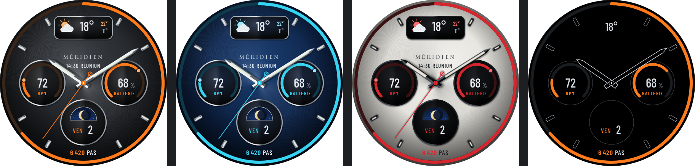
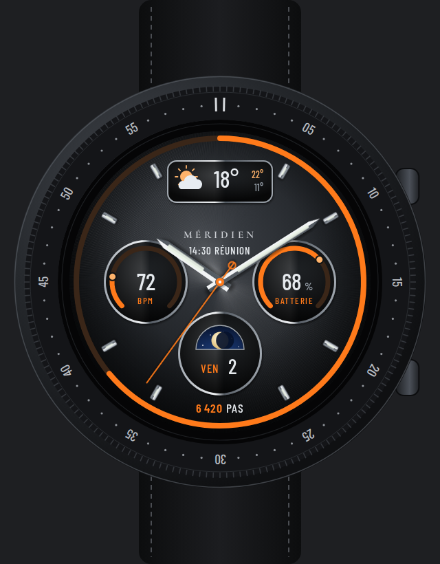
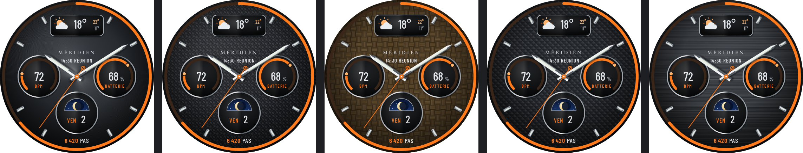

# Méridien — maquette

Finition haute horlogerie, densité d'information d'une montre connectée. Dessin original.
Maquette seulement : pas encore de paquet WFF.

**v2 — lisibilité d'abord** (écran 438 px ≈ 34 mm, ~13 px par mm) : plus de graduations
décoratives (seulement 8 index), jauges en arc épais, une grosse valeur par zone (28-34 px),
libellés ≥ 13 px, police condensée **Barlow Condensed SemiBold**.





| Zone | Donnée | Source WFF |
|---|---|---|
| Compteur 9 h | Fréquence cardiaque, arc 40–200 + valeur | `[HEART_RATE]` |
| Compteur 3 h | Batterie façon réserve de marche, zone rouge < 20 % | `[BATTERY_PERCENT]` |
| Compteur 6 h | Phase de lune, jour et date | `[MOON_PHASE_POSITION]`, `[DAY_OF_WEEK]`, `[DAY]` |
| Cartouche 12 h | Météo : icône, température, max / min, état | `[WEATHER.*]` (WFF v2) |
| Pourtour | Anneau de progression des pas | `[STEP_PERCENT]` |
| Centre haut | Prochain événement | complication `LONG_TEXT` |
| Bas | Nombre de pas | `[STEP_COUNT]` |
| Centre | Heures, minutes, trotteuse centrale | `[HOUR_0_11]`, `[MINUTE]`, `[SECOND]` |

## Textures du fond



Réglage « Texture » : **soleillé**, **carbone** (sergé), **fibre de bambou** (lanières tissées en toile), **clous de Paris**,
**acier brossé**. En WFF : une image PNG 438 × 438 par texture dans une `ListConfiguration`
(une seule chargée en mémoire), vignette commune par-dessus ; les textes restent sur fond
sombre pour rester lisibles quelle que soit la texture.

Coloris : anthracite / orange, bleu glacier / cyan, panda (cadran blanc, compteurs noirs) /
rouge. AOD : noir pur, aiguilles et index en filet, anneau des pas conservé.

```bash
node concepts/meridien/render.mjs   # Playwright + Chromium, ImageMagick
```

Polices partagées avec `concepts/nocturne/fonts/` : Barlow Condensed, Cormorant Garamond (OFL).
