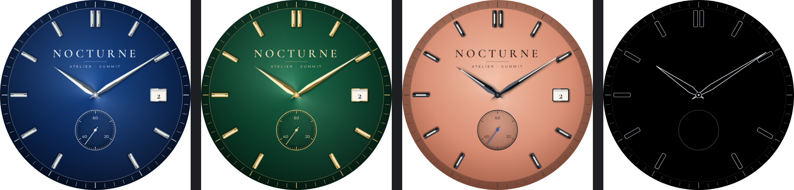
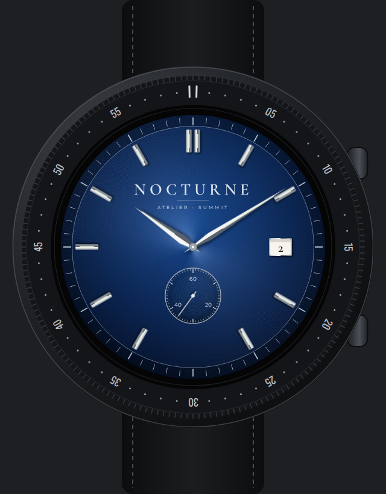

# Nocturne — maquette

Cadran analogique d'inspiration haute horlogerie, **dessin original** (aucune marque, aucun
élément repris d'une montre existante). Maquette seulement : pas encore de paquet WFF.





- Cadran **soleillé** (rayons dont l'éclat varie avec l'angle) et rehaut plus sombre portant
  le chemin de fer.
- **Index appliqués** facettés avec insert luminescent ; double index à midi.
- **Aiguilles dauphine** à deux facettes, ombres portées.
- **Petite seconde** guillochée (cercles concentriques) à 6 h, **guichet de date** à 3 h.
- Coloris : bleu nuit / acier, vert impérial / or, saumon / acier sombre et trotteuse bleuie.
- **AOD** : noir pur, index et aiguilles en filet, petite seconde coupée.

Passage en Watch Face Format : soleillé, index et aiguilles en PNG (les dégradés ne s'affichent
pas sur la montre, cf. race/README.md), rotations des aiguilles par `Transform`, date par
`[DAY]`, coloris par `ColorConfiguration` ou jeux d'images.

```bash
node concepts/nocturne/render.mjs   # Playwright + Chromium, ImageMagick
```

Polices : Cormorant Garamond et Montserrat, SIL Open Font License 1.1 (`fonts/`).
