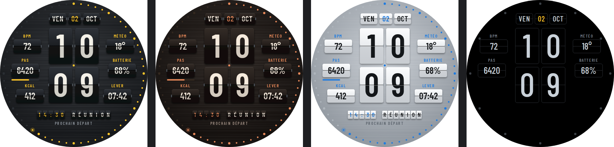
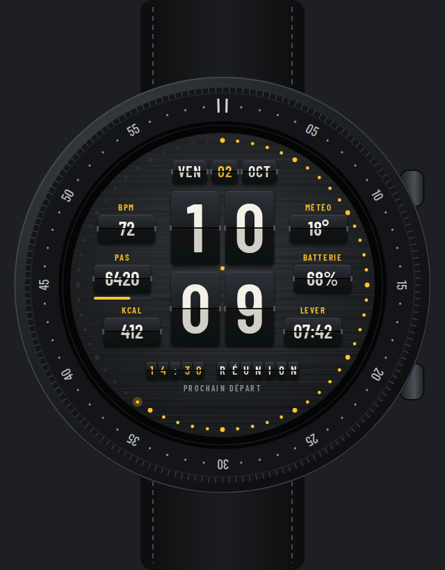

# Palettes — maquette de cadran numérique

Afficheur à palettes (tableaux des départs des gares et aéroports) : heures et minutes sur
deux lignes, une palette par chiffre. Dessin original ; maquette, pas encore de paquet WFF.





| Zone | Contenu | Source WFF |
|---|---|---|
| Centre | HH / MM, une palette par chiffre (pli, charnières, ombre) | `[HOUR_0_23_Z]`, `[MINUTE_Z]` |
| Haut | Jour, date, mois sur trois palettes | `[DAY_OF_WEEK_S]`, `[DAY_Z]`, `[MONTH_S]` |
| Colonne gauche | Cardio, pas + barre d'objectif, calories | `[HEART_RATE]`, `[STEP_COUNT]`, `[STEP_PERCENT]`, complication |
| Colonne droite | Météo, batterie, lever du soleil | `[WEATHER.TEMPERATURE]`, `[BATTERY_PERCENT]`, complication |
| Bas | Prochain événement en « tableau des départs » | complication `LONG_TEXT` |
| Pourtour | 60 LED : les secondes s'allument au fil de la minute | `[SECOND]` |

Signature visuelle : le pli qui coupe chaque chiffre, la moitié basse plus sombre (volet
incliné), les charnières, le tableau des départs. Sur la montre, la bascule des palettes au
changement de minute est animable (`Transform` sur `scaleY`).

Coloris : gare (noir / jaune), cuivre, arctique (palettes blanches / bleu). AOD : palettes en
filet, chiffres gris, LED des 5 minutes seulement ; ≈ 10 % de pixels allumés.

Polices : Barlow Condensed (OFL, `../strate/fonts/`).

```bash
node concepts/palettes/render.mjs   # Playwright + Chromium, ImageMagick
```
