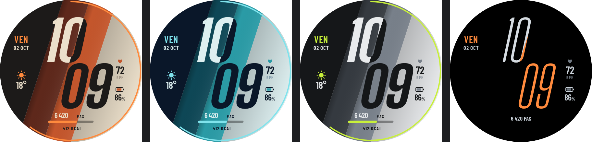
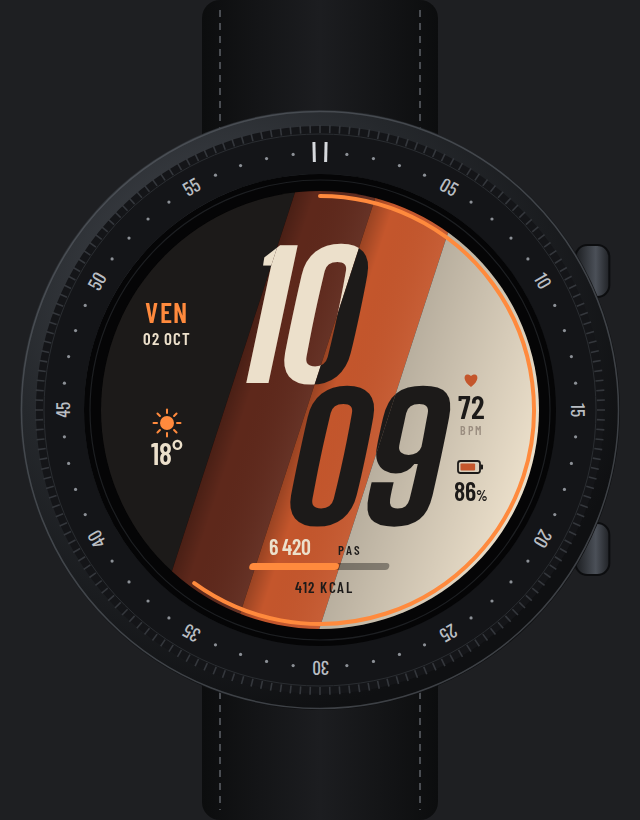
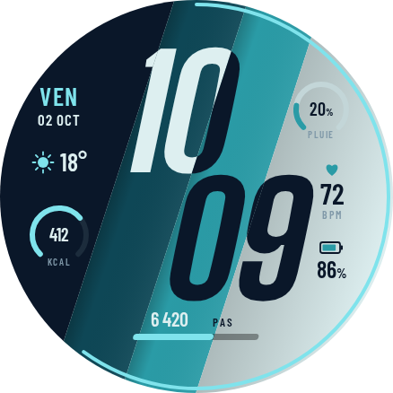

# Prisme — maquette de cadran numérique

Bandes de couleur **en diagonale** ; heures et minutes **sur deux lignes**, en chiffres géants
penchés qui **changent de couleur à chaque bande** traversée (clairs sur bandes sombres,
sombres sur bandes claires). Dessin original ; maquette, pas encore de paquet WFF.





| Zone | Contenu | Source WFF |
|---|---|---|
| Centre | HH puis MM décalées le long de la diagonale | `[HOUR_0_23_Z]`, `[MINUTE_Z]` |
| Gauche (bande sombre) | Jour, date, météo | `[DAY_OF_WEEK_S]`, `[DAY_Z]`, `[MONTH_S]`, `[WEATHER.TEMPERATURE]` |
| Droite (bande claire) | Cardio, batterie | `[HEART_RATE]`, `[BATTERY_PERCENT]` |
| Bas | Pas + barre d'objectif penchée, calories | `[STEP_COUNT]`, `[STEP_PERCENT]`, complication |
| Bord | Secondes (arc) | `[SECOND]` |

Palettes : **volcan** (charbon, rouille, terre cuite, sable), **lagune** (marine, pétrole,
turquoise, glace), **ardoise** (graphite, gris, acier, craie) avec accents orange / cyan / lime.
AOD : noir pur, chiffres en graisse fine (minutes en couleur d'accent).

### Essai « plus de données » (lagune)



Deux jauges en arc dans les zones libres : **pluie** (haut droite, bande claire,
`[WEATHER.CHANCE_OF_PRECIPITATION]`) et **calories / objectif** (bas gauche, bande sombre,
complication `RANGED_VALUE`). La météo remonte sur une ligne à côté de la date.

Différences avec les cadrans « à bandes » existants : bandes diagonales (pas verticales),
heure sur deux lignes (pas en escalier sur une ligne), chiffres penchés, données disposées
dans les bandes extrêmes, palettes propres.

En WFF : bandes = `Rectangle` dans un `Group` tourné ; chiffres redessinés par bande dans des
`Group` masqués, ou modes de fusion (WFF v3+).

```bash
node concepts/prisme/render.mjs   # Playwright + Chromium, ImageMagick
```
