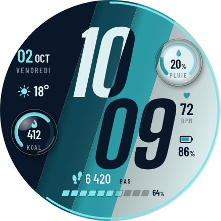
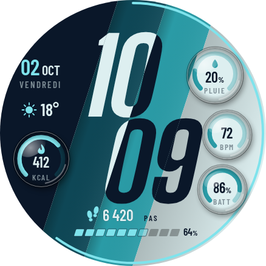
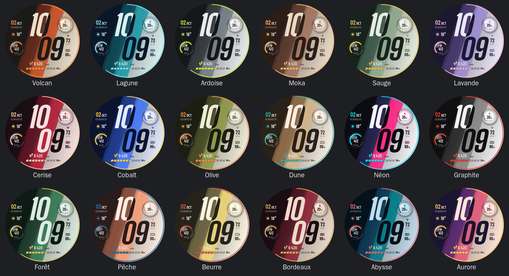
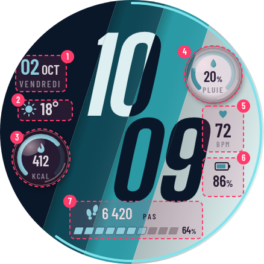
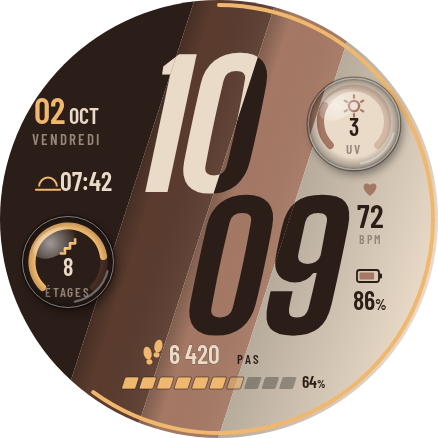

# Prisme — maquette de cadran numérique

Bandes de couleur **en diagonale** ; heures et minutes **sur deux lignes**, en chiffres géants
penchés qui **changent de couleur à chaque bande** traversée (clairs sur bandes sombres,
sombres sur bandes claires). Dessin original ; maquette, pas encore de paquet WFF.


| Zone | Contenu | Source WFF |
|---|---|---|
| Centre | HH puis MM décalées le long de la diagonale | `[HOUR_0_23_Z]`, `[MINUTE_Z]` |
| Gauche (bande sombre) | Jour, date, météo | `[DAY_OF_WEEK_S]`, `[DAY_Z]`, `[MONTH_S]`, `[WEATHER.TEMPERATURE]` |
| Droite (bande claire) | Cardio, batterie | `[HEART_RATE]`, `[BATTERY_PERCENT]` |
| Bas | Pas + barre d'objectif penchée, calories | `[STEP_COUNT]`, `[STEP_PERCENT]`, complication |
| Bord | Secondes (arc) | `[SECOND]` |

Palettes : **volcan** (charbon, rouille, terre cuite, sable), **lagune** (marine, pétrole,
turquoise, glace), **ardoise** (graphite, gris, acier, craie) avec accents orange / cyan / lime.
AOD : noir pur, chiffres en graisse fine (minutes en couleur d'accent).

### Essai « plus de données » (lagune)


Deux jauges en arc dans les zones libres : **pluie** (haut droite, bande claire,
`[WEATHER.CHANCE_OF_PRECIPITATION]`) et **calories / objectif** (bas gauche, bande sombre,
complication `RANGED_VALUE`). La météo remonte sur une ligne à côté de la date.

### Essai « dôme » : loupes sur les jauges



Chaque jauge est sous un dôme de verre : jauge **et fond** grossis d'environ 20 % (la limite
entre bandes se décale comme à travers une lentille), bord assombri (réfraction), reflet en
haut à gauche, croissant de lumière en bas à droite, ombre portée. En WFF : `Group` mis à
l'échelle (`scaleX`/`scaleY`) sous un masque rond, verre et reflets en PNG translucide.

Pictogrammes : goutte (pluie) et flamme (calories) dans les dômes ; empreintes devant le
nombre de pas. Barre des pas en **10 segments penchés** comme les bandes (segment en cours à
demi-teinte, contour sombre pour rester lisible sur toutes les bandes) et pourcentage au bout.

### Essai « 4 dômes »



Cardio et batterie aussi en jauges sous dôme (minutes décalées de 16 px vers la gauche).
Avis : la colonne de trois bulles à droite charge l'équilibre et concurrence les minutes ;
la version à **deux dômes en diagonale** (pluie en haut à droite, calories en bas à gauche),
qui fait écho aux bandes, reste la plus lisible.

## Version retenue : 2 dômes, 18 palettes, 7 emplacements au choix

### Palettes (réglage « Palette »)



| Famille | Palettes |
|---|---|
| Tons terre et naturels (tendance « earthy », brun moka) | Volcan, Moka, Dune, Olive, Sauge, Forêt |
| Bleus et eaux | Lagune, Abysse, Cobalt |
| Pastels doux (lavande, pêche, jaune beurre) | Lavande, Pêche, Beurre |
| Vins et rouges profonds | Cerise, Bordeaux |
| Vifs et nocturnes | Néon, Aurore |
| Neutres | Ardoise, Graphite |

Chaque palette = 4 bandes (sombre → claire) + 1 accent. L'encre des chiffres et des textes est
choisie **par bande selon la luminance** (la plus contrastée des deux extrêmes) : l'effet
d'inversion des chiffres fonctionne avec toutes. En WFF : une `ColorConfiguration` à
18 options de 5 couleurs (+ encres précalculées).

### Emplacements de données (tous personnalisables)



| N° | Zone | Par défaut | Exemples de choix |
|---|---|---|---|
| 1 | Haut gauche | Date en gros (jour du mois en accent + mois), jour de la semaine en petit dessous | Fuseau horaire, prochain événement |
| 2 | Gauche | Météo (icône + température) | Lever / coucher du soleil, notifications |
| 3 | Dôme bas gauche | Calories / objectif | Étages, minutes actives, eau, stress |
| 4 | Dôme haut droite | Probabilité de pluie | Indice UV, SpO2, batterie du téléphone |
| 5 | Droite | Fréquence cardiaque | Toute donnée courte |
| 6 | Droite bas | Batterie | Toute donnée courte |
| 7 | Bas | Pas + barre segmentée | Distance, objectif d'activité |

Ce sont 7 complications (WFF : 8 maximum). Les dômes acceptent les types à plage de valeur
(`RANGED_VALUE`, `GOAL_PROGRESS`) pour la jauge, ou un texte court ; les emplacements texte
affichent l'icône fournie par la source de données.



*Exemple, palette Moka : UV et étages dans les dômes, lever du soleil à gauche.*

Différences avec les cadrans « à bandes » existants : bandes diagonales (pas verticales),
heure sur deux lignes (pas en escalier sur une ligne), chiffres penchés, données disposées
dans les bandes extrêmes, palettes propres.

En WFF : bandes = `Rectangle` dans un `Group` tourné ; chiffres redessinés par bande dans des
`Group` masqués, ou modes de fusion (WFF v3+).

```bash
node concepts/prisme/render.mjs   # Playwright + Chromium, ImageMagick
```
