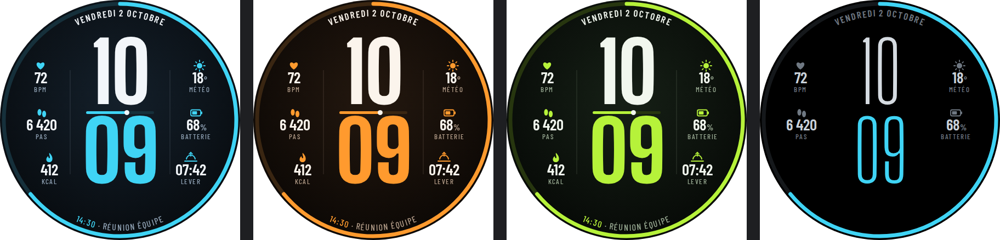
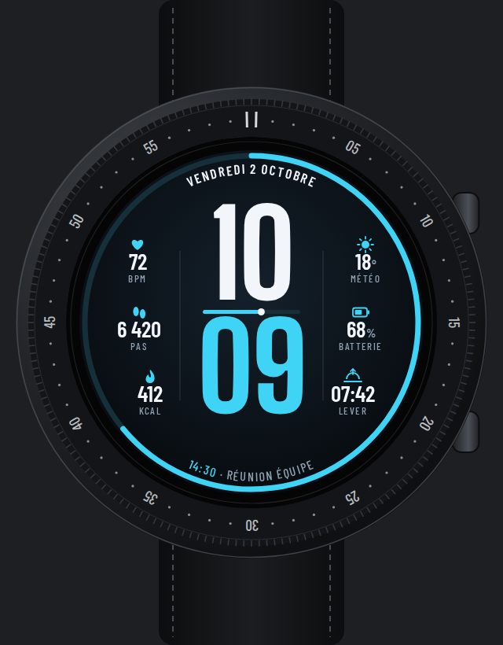

# Strate — maquette de cadran numérique

Heures et minutes **sur deux lignes**, en très grands chiffres, encadrées de deux colonnes
de données. Dessin original ; maquette seulement, pas encore de paquet WFF.





| Zone | Contenu | Source WFF |
|---|---|---|
| Centre | HH (blanc) / MM (couleur), trait des secondes entre les deux | `[HOUR_0_23_Z]`, `[MINUTE_Z]`, `[SECOND]` |
| Colonne gauche | Cardio, pas, calories | `[HEART_RATE]`, `[STEP_COUNT]`, complication |
| Colonne droite | Météo, batterie, lever du soleil | `[WEATHER.TEMPERATURE]`, `[BATTERY_PERCENT]`, complication |
| Haut, en courbe | Jour et date en toutes lettres | `[DAY_OF_WEEK_F]`, `[DAY]`, `[MONTH_F]` (`TextCircular`) |
| Bas, en courbe | Prochain événement | complication `LONG_TEXT` |
| Pourtour | Anneau de progression des pas | `[STEP_PERCENT]` |

Lisibilité (écran 438 px ≈ 34 mm) : chiffres de l'heure ≈ 110 px de haut, valeurs 29 px,
libellés ≥ 13 px, aucune graduation décorative.

Coloris : glacier (cyan), ambre (orange), lime. AOD : noir pur, mêmes chiffres en graisse fine
(Big Shoulders 300), cardio / pas / météo / batterie conservés ; ≈ 11 % de pixels allumés.

Polices (OFL, `fonts/`) : **Big Shoulders Display** pour l'heure, **Barlow Condensed** pour
les données.

```bash
node concepts/strate/render.mjs   # Playwright + Chromium, ImageMagick
```
