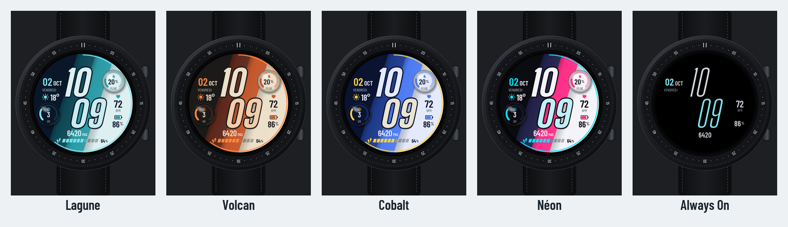
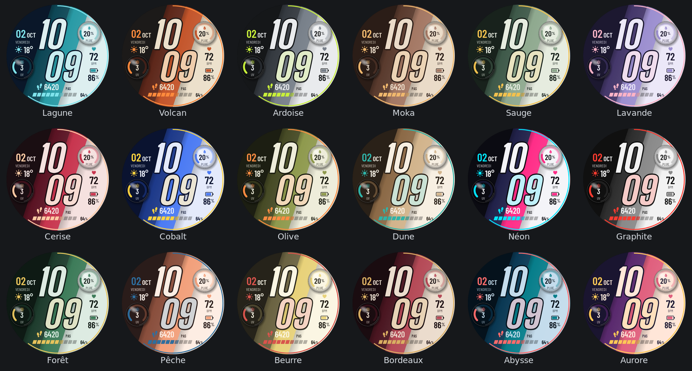
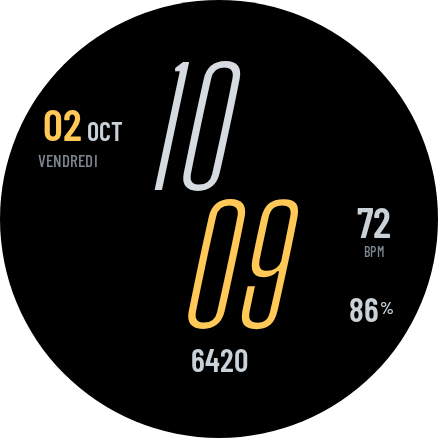

# Prisme — guide du cadran

Cadran numérique pour Galaxy Watch (Wear OS 5 et plus), conçu sur une Galaxy Watch8
Classic.

## En un coup d'œil

- **Heure** sur deux lignes, en grands chiffres italiques. Les chiffres sont clairs, avec un
  contour sombre et une ombre : ils restent lisibles sur toutes les bandes. Les minutes sont
  légèrement teintées de la couleur d'accent.
- **Quatre bandes diagonales**, de la plus sombre à la plus claire. 18 palettes au choix.
- **Deux dômes en verre** : un effet loupe (contenu agrandi, reflet, ombre portée) pour mettre
  en valeur deux données.
- **Sept emplacements de données**. Chacun montre une donnée par défaut et accepte n'importe
  quelle complication de la montre.
- **Secondes** au choix (*Personnaliser > Secondes*) : arc qui se remplit sur le pourtour (par défaut), point qui tourne, ou aucune.
- **Batterie faible** : à 20 % ou moins, la pile et le pourcentage passent en rouge (aussi en mode toujours allumé).
- **Mode toujours allumé (AOD)** : fond noir, chiffres fins, environ 6 % des pixels allumés.

## Les données

| # | Emplacement | Donnée par défaut | Au toucher |
|---|---|---|---|
| 1 | haut gauche | date : jour du mois, mois, jour de la semaine | Calendrier |
| 2 | gauche | météo : pictogramme et température | Météo Samsung |
| 3 | dôme bas gauche | indice UV, en jauge | Météo Samsung |
| 4 | dôme haut droite | probabilité de pluie, en jauge | Météo Samsung |
| 5 | droite | fréquence cardiaque | Fréquence cardiaque |
| 6 | droite | batterie | État de la batterie |
| 7 | bas | pas, avec une barre de 10 segments et le % de l'objectif | Samsung Health |

### Changer une donnée

1. Faites un appui long sur le cadran, puis touchez **Personnaliser**.
2. Faites défiler jusqu'à **Complications** et touchez l'emplacement à modifier.
3. Choisissez une source : Samsung Health, Météo, Santé Sync, etc. Choisissez **Vide** pour
   revenir à la donnée par défaut.

Chaque emplacement accepte tous les types de complication. L'affichage s'adapte au type :

- **Dans un dôme** : une donnée avec un maximum ou un objectif s'affiche en jauge circulaire,
  les autres en texte.
- **En bas** : une donnée avec un objectif remplit la barre de 10 segments.
- **À droite et à gauche** : la donnée s'affiche avec un pictogramme, une valeur et un titre.

La personnalisation depuis la montre est plus fiable que depuis l'appli Galaxy Wearable du
téléphone, qui affiche parfois des listes incomplètes.

## Les 18 palettes

*Personnaliser > Palette*. Lagune est la palette par défaut.

Lagune, Volcan, Ardoise, Moka, Sauge, Lavande, Cerise, Cobalt, Olive, Dune, Néon, Graphite,
Forêt, Pêche, Beurre, Bordeaux, Abysse, Aurore.

## Mode toujours allumé

Ce mode garde l'heure, la date, la fréquence cardiaque, la batterie et les pas, en couleurs
sobres sur fond noir pour économiser la batterie.

## Encore plus de données avec Santé Sync

Samsung ne laisse pas les cadrans tiers lire le **score d'énergie**, le **score de sommeil**
et plusieurs autres données de Samsung Health. Santé Sync (dossiers `energyscore-phone` et
`energyscore-watch`) contourne cette limite légalement :

- **L'appli téléphone** lit Samsung Health avec le SDK officiel de Samsung. Elle envoie les
  valeurs à la montre toutes les 30 minutes.
- **L'appli montre** propose ces valeurs en complications : 26 données, dont le score
  d'énergie, le score et la durée de sommeil, la distance, les calories, les étages, l'eau, la
  SpO2, la tension, le poids, l'IMC et le VO2 max. Elle mesure aussi en direct les pas, la
  distance, les calories et les étages.
- **Au toucher**, une complication Santé Sync ouvre Samsung Health sur la montre.

Santé Sync fonctionne aujourd'hui en mode développeur Samsung Health, donc pour un usage
personnel. Une diffusion publique demande un accord partenaire avec Samsung (voir
`PROJET.md` à la racine du dépôt).

## Questions fréquentes

**Un emplacement affiche « -- ».** La source n'a pas encore de valeur. Par exemple, pas de
météo sans connexion, ou un score de sommeil avant la première nuit.

**Le score d'énergie n'apparaît pas dans la liste Samsung Health.** C'est normal : Samsung
réserve cette complication à ses propres cadrans. Utilisez Santé Sync.

**Toucher une donnée ne fait rien.** Vérifiez que l'appli visée (Météo, Samsung Health) est
installée sur la montre.
