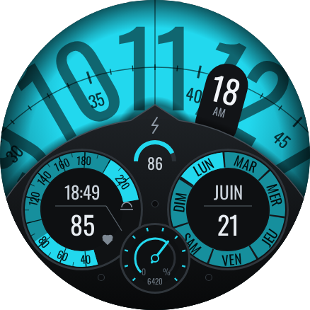
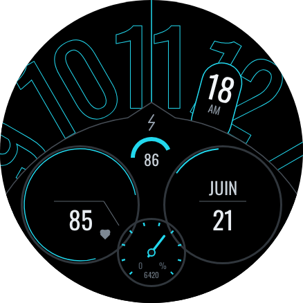

# Race — cadran numérique « cockpit »

Deuxième cadran du dépôt, inspiré de la mise en page de
[S4U Race](https://play.google.com/store/apps/details?id=com.watchfacestudio.s4urace) (styles4you) :
un grand disque d'heures qui défile sous un index, et un cockpit sombre avec trois compteurs.
Le dessin est refait de zéro en Watch Face Format, sans aucune ressource de l'original — usage
personnel. Ne pas le publier sur le Play Store sous ce nom ni avec ce design sans l'accord de
l'auteur original.

Même cible que Summit : **Galaxy Watch8 Classic 46 mm**, toile 438 × 438, WFF v4, paquet
sans code (`android:hasCode="false"`).

 

## Lecture de l'heure

- **Heure** : un grand disque de chiffres 1 à 12, centré **sous** l'écran (y 335), avance d'un
  cran de 30° par heure ; l'heure se lit sous l'**index vertical**. Comme sur l'original, on ne
  voit que trois chiffres.
- **Minutes** : la pastille inclinée à droite de l'index, avec AM/PM.
- **Secondes** : un grand anneau gradué, centré lui aussi sous l'écran (y 396), tourne de 6°
  par seconde sous l'index (mode normal seulement).

## Cockpit

| Zone | Contenu | Appui |
|---|---|---|
| Bosse en pointe | Batterie : demi-jauge + pourcentage | ouvre l'état de la batterie |
| Compteur gauche | Fréquence cardiaque sur 3/4 de tour, 40 en bas → 220 en haut à droite, zone 200+ en couleur ; valeur au centre (« -- » si aucune mesure) | ouvre la mesure cardio |
| Compteur gauche, haut | **Conteneur de données** (complication 1, par défaut lever/coucher du soleil), texte + icône du fournisseur | celui de la complication |
| Compteur droit | Couronne des jours de la semaine, jour courant en couleur ; mois et jour au centre | raccourci 5 |
| Petit compteur bas, posé sur les deux autres | Progression vers l'objectif de pas (aiguille + arc), nombre de pas | raccourci 6 |

**5 raccourcis invisibles** (complications 2 à 6) : haut gauche, droite, haut (sur l'index),
date, pas. Appui long → Personnaliser → Complications → choisir une appli.

## Réglages

| Réglage | Options |
|---|---|
| Couleur principale | 10 couleurs (cadran, dégradé radial) |
| Couleur des compteurs | 13 couleurs (jauges, aiguille, batterie) |
| Cockpit | Par défaut, Assombri |
| Motif | Aucun, Points, Rayures |
| Ombre | Par défaut, Moins d'ombre |
| Jours de la semaine | Français, English, Deutsch, Español, Italiano |

Le nom du mois vient de la langue de la montre (`[MONTH_S]`).

## AOD

Fond et cockpit noir pur, chiffres d'heure en **contour seul**, compteurs réduits à leurs
filets, secondes et motif coupés. ≈ 8 % de pixels allumés sur l'aperçu (limite 15 %).

## Construire et installer

```bash
./gradlew :race:assembleDebug
adb install -r race/build/outputs/apk/debug/race-debug.apk
```

Installation sur la montre : même procédure que Summit (README principal). Les deux cadrans
ont des identifiants différents (`com.jvienne.summit`, `com.jvienne.race`) et coexistent.

## Modifier le cadran

`src/main/res/raw/watchface.xml` est **généré** : 12 chiffres, 60 graduations, 7 jours × 5
langues… Tout est décrit dans `tools/generate.py`, qui écrit aussi un aperçu SVG rendu avec les
mêmes coordonnées.

```bash
python3 race/tools/generate.py        # watchface.xml, motifs PNG, aperçus SVG
node race/tools/render-preview.mjs    # aperçus PNG (Playwright + Chromium)
```

Les réglages de géométrie sont en tête du script (`HOURS_C`, `SEC_C`, `COCKPIT_C`, `LEFT_C`…).
Ils ont été relevés sur une capture de l'original ramenée à 438 × 438 ; l'aperçu est rendu à
11:18:38, comme cette capture, pour pouvoir les comparer côte à côte.

Différence volontaire : les noms de jours du bas de la couronne sont retournés pour rester
lisibles (l'original les laisse tête en bas).

## Vérifications faites

- Le XML passe le validateur officiel Watch Face Format **v4** (`google/watchface`,
  `third_party/wff`).
- Toutes les ressources référencées existent (polices, images, chaînes).
- Les sources de données utilisées sont toutes de la version 1 du format : `HOUR_0_11`,
  `MINUTE`, `MINUTE_Z`, `SECOND`, `AMPM_STRING`, `DAY`, `DAY_OF_WEEK`, `MONTH_S`,
  `BATTERY_PERCENT`, `HEART_RATE`, `STEP_COUNT`, `STEP_PERCENT`.

## À valider au premier build

Non compilé ici (le dépôt Maven de Google n'était pas joignable) et pas encore vu sur montre.

- **Alignement vertical du texte** dans les `PartText` : l'aperçu centre le texte dans sa
  boîte ; si la montre le place autrement, ajuster `y`/`h` dans le script.
- **Rotation des `Group`** par `Transform target="angle"` (disque des heures, anneau des
  secondes) et des `Arc` en pointillés (`dashIntervals`) pour les graduations.
- Les raccourcis ne dessinent rien : vérifier qu'un appui lance bien l'appli choisie.
- `[STEP_PERCENT]` suit l'objectif de pas réglé sur la montre (et non 10 000 pas fixes).

## Licences

Oswald et Chakra Petch, SIL Open Font License 1.1 (textes dans `licences/` à la racine).
