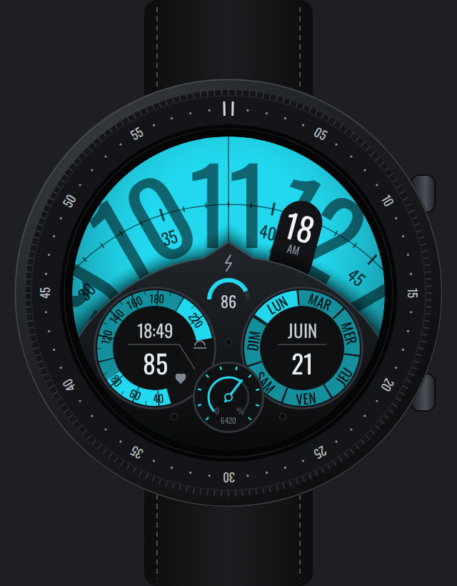

# Émulateur « Galaxy Watch8 Classic »

Samsung ne publie ni image système One UI Watch pour Android Studio, ni skin d'émulateur pour
ses montres (les skins officiels ne couvrent que téléphones et tablettes). Ce dossier fournit
de quoi s'en approcher avec l'image **Wear OS 6 (API 36)** de Google — la base de One UI 8 Watch :

- `galaxy-watch8-classic.xml` : profil matériel importable — écran rond 1,34", 438 × 438 px
  (fiche Samsung), `ro.emulator.circular` activé ;
- `skin-galaxy-watch8-classic/` : skin dessiné (boîtier noir, lunette graduée, deux boutons,
  bracelet) avec son masque rond. Dessin original, aucune image Samsung.



L'interface reste celle de Wear OS (pas de One UI, ni Samsung Health, ni lunette rotative
fonctionnelle) : pour le rendu exact, rien ne remplace la vraie montre en ADB Wi-Fi.

## Installer

1. Récupérer ce dossier sur le PC (`git pull` de la branche, ou *Code → Download ZIP* sur
   GitHub) et copier `skin-galaxy-watch8-classic/` dans un endroit fixe, par exemple
   `C:\Users\<toi>\AppData\Local\Android\Sdk\skins\` (Windows) ou `~/Android/Sdk/skins/`.
2. Android Studio → **Device Manager → + → Create Virtual Device** →
   **Import hardware profile…** → choisir `galaxy-watch8-classic.xml`.
3. Le profil « Galaxy Watch8 Classic 46mm » apparaît dans la catégorie **Wear OS**.
   Le sélectionner, puis image **Wear OS 6 — API 36**.
4. Dans les options avancées de l'appareil virtuel (*Additional settings* / *Show Advanced
   Settings*), champ **Skin** (ou *Device skin*) : choisir le dossier
   `skin-galaxy-watch8-classic`. À défaut, éditer le profil (*Edit hardware profile*) et le
   désigner dans **Default Skin**.
5. Démarrer l'émulateur, puis `adb install -r race-debug.apk`.

Astuce : dans Android Studio, l'émulateur s'affiche par défaut dans un onglet de l'IDE, qui
peut ignorer les skins. Pour voir le boîtier : *Settings → Tools → Emulator* → décocher
**Launch in the Running Devices tool window**, l'émulateur s'ouvre alors dans sa propre fenêtre.

## Régénérer le skin

```bash
node race/emulator/build-skin.mjs   # Playwright + Chromium
```
